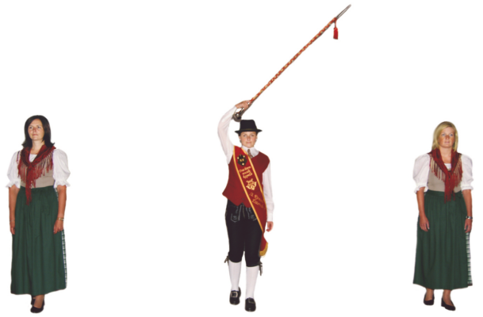
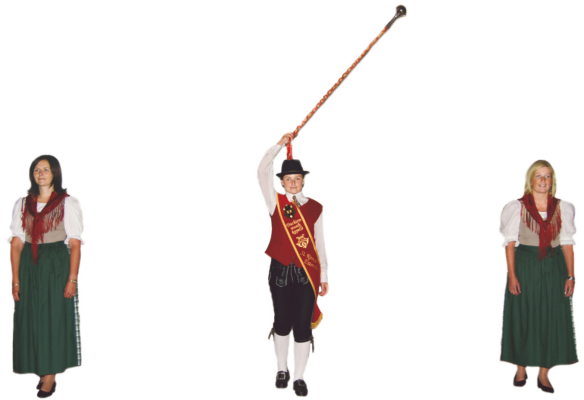
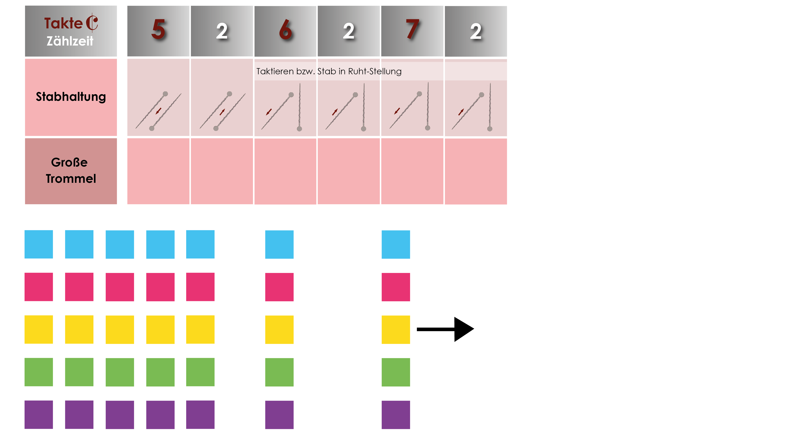
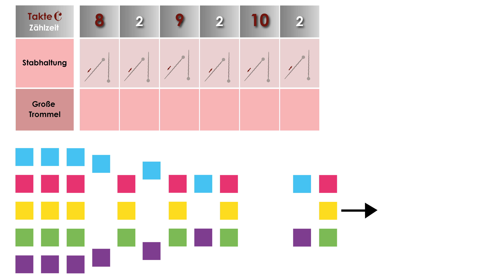
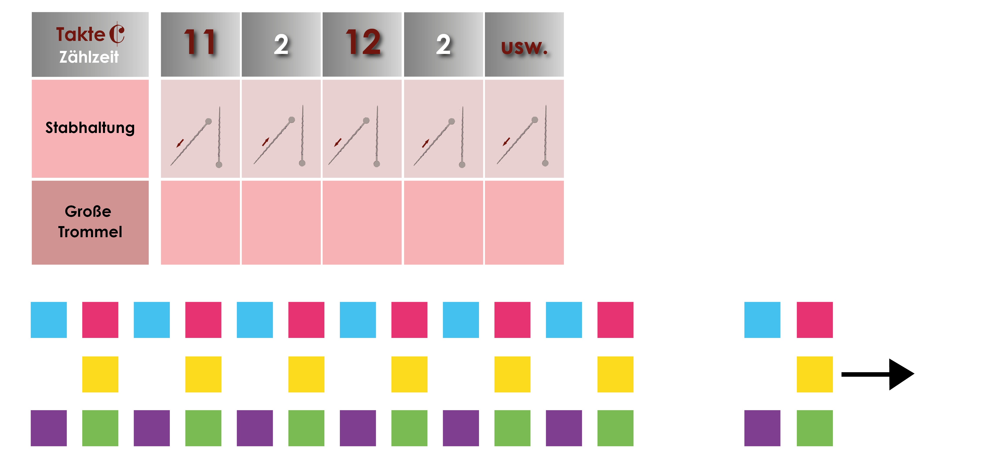
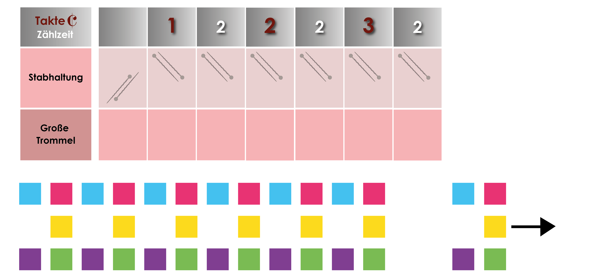
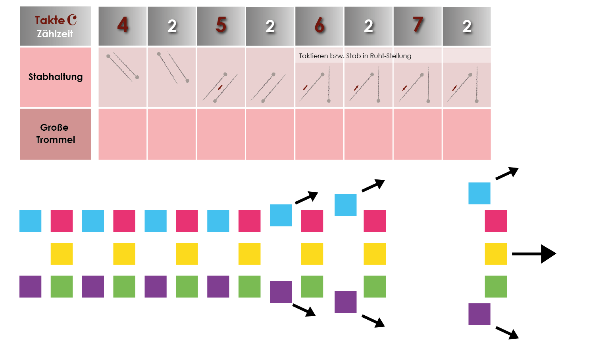
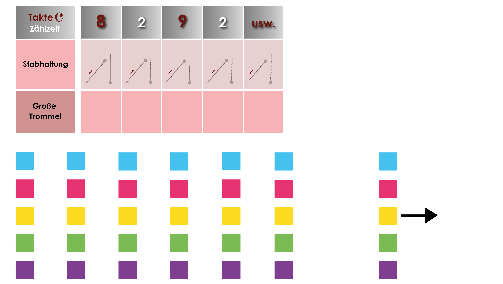
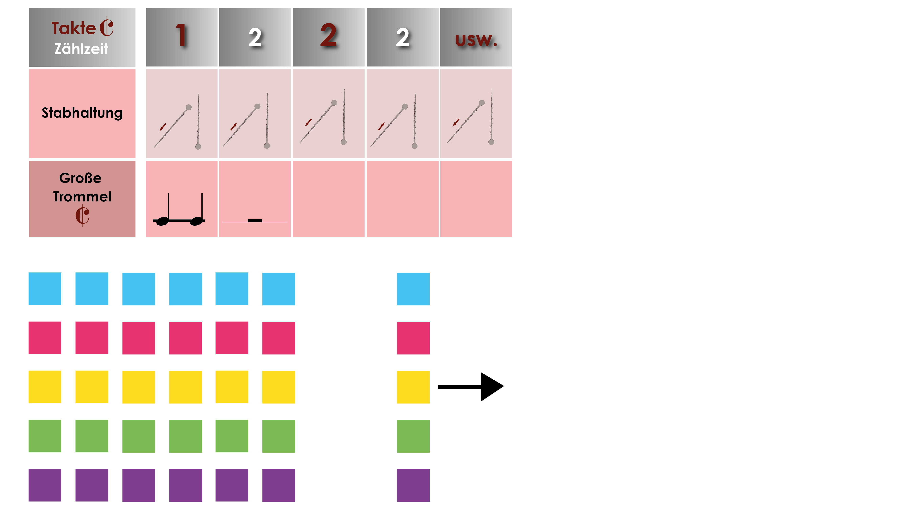

[← Zurück zur Übersicht](README.md)

---

# Kapitel 4 — Abfallen und Aufmarschieren · Reißverschluss

Enge Stellen gibt es überall: Tore, schmale Gassen, Brücken. Deshalb ist das Abfallen keine reine Wertungsdisziplin, sondern etwas, das wir ohnehin brauchen.

> **Kein Kommando. Kein Aviso.** Der Stab geht hoch — und wir sind dran.

---

## Das Grundprinzip

Die **Flügelmusiker** — die äußeren Reihen — rücken nach innen. Nicht alle auf einmal, sondern **nach und nach von vorne nach hinten**. Das sieht aus wie ein Reißverschluss, der zugeht. Daher der Name.

Damit das funktioniert, brauchen die Reihen zuerst **mehr Tiefenabstand**. Den holen wir uns über den **kurzen Schritt**.

> ### Auch in der abgefallenen Formation sind die **Außenreihen voll besetzt**.
> Wir werden schmäler, nicht löchrig.

---

## Der kurze Schritt

**Das Tempo bleibt gleich. Nur die Schrittlänge wird kürzer.**

Das ist der ganze Trick: Wer kürzer tritt, fällt zurück — ohne aus dem Gleichschritt zu fallen. Die vordere Linie geht normal weiter, der Abstand wächst.

> Wer stattdessen langsamer geht, zerstört den Gleichschritt der ganzen Kapelle.

---

## Das Zeichen

Der Stab wird **über der Kopfmitte nach links** gehalten. Zwei Varianten, je nachdem ob gespielt wird:

**Ohne klingendes Spiel:**

**Mit klingendem Spiel:**

> **Bei diesem Zeichen gibt es kein Aviso.** Wer nicht hinschaut, merkt nichts.

---

## Abfallen

### Takt 1–4 · Der Stab geht hoch

Der Stabführer gibt aus der Grundstellung (1 Takt) das Zeichen und hält den Stab **4 Takte** über der Kopfmitte nach links.

**Wir:** hinschauen, weiterspielen, normal marschieren.

---

### Takt 5 · Tiefenabstand herstellen

Der Stab kommt in Grundstellung. Jetzt marschieren **alle im kurzen Schritt** — außer den **drei mittleren Reihen der 1. Linie**. Der nötige Tiefenabstand entsteht nach und nach.

---

### Danach · Der Reißverschluss

Die **Flügelmusiker rücken nach und nach in die inneren Reihen** — **beginnend mit der 1. Linie**, dann Linie für Linie nach hinten.

Hat die Kapelle nur 2 Marketenderinnen, rücken sie zum Stabführer.

> **Marschformation im abgefallenen Zustand erreicht.**

---

## Aufmarschieren

### Takt 1–4 · Der Stab geht wieder hoch

Gleiches Zeichen, gleiche vier Takte.

---

### Takt 5 · Zurück nach außen

Der Stab kommt in Grundstellung. Bei klingendem Spiel wird im Takt darauf weiter taktiert.

**Stabführer (mit Marketenderinnen) sowie 2., 3. und 4. Reihe:** kurzer Schritt.
**Flügelmusiker:** in **definierten Schritten (4, 6 oder 8)** wieder in die äußeren Reihen — **beginnend mit der 1. Linie**.
**Alle anderen:** kurzer Schritt.

> **4, 6 oder 8 Schritte — das legt unser Stabführer fest.** Diese Zahl muss jeder auswendig wissen.

---

### Danach · Tiefenabstand zurückholen

Alle Linien stellen den **ursprünglichen Tiefenabstand** wieder her.

---

### Zum Schluss · Normalschritt

Die **Große Trommel** gibt das akustische Zeichen für den Normalschritt. Im **nächsten Takt** nimmt ihn die **gesamte Formation** auf.

> ### Das ist der letzte Knackpunkt.
> Nicht beim Zeichen umschalten, sondern **im Takt danach** — und dann alle gemeinsam.

---

## Wer bin ich?

| Rolle | Beim Abfallen | Beim Aufmarschieren |
|---|---|---|
| **1. Linie, drei mittlere Reihen** | Normalschritt, Tempo halten | Normalschritt |
| **Flügelmusiker (außen)** | nach innen rücken, Linie für Linie | in 4/6/8 Schritten nach außen |
| **Innere Reihen** | kurzer Schritt | kurzer Schritt |
| **Stabführer, Marketenderinnen** | Normalschritt | kurzer Schritt |

> **Klär vor der Wertung: Bin ich Flügelmusiker? In welcher Linie? Und wie viele Schritte?**

---

## Die häufigsten Fehler

- **Langsamer** gehen statt **kürzer** treten → Gleichschritt weg
- Alle Flügelmusiker rücken **gleichzeitig** ein → das ist Variante 2, nicht der Reißverschluss
- Beim Reißverschluss nicht mit der **1. Linie** beginnen
- Die Außenreihen nach dem Abfallen **nicht voll besetzen**
- Beim akustischen Zeichen **sofort** in den Normalschritt statt im Takt danach
- Auf ein Aviso warten — **es gibt keines**

> **Der Test:** Von außen betrachtet muss das Einrücken wie eine Welle nach hinten laufen. Wenn es aussieht wie ein Sprung, war es Variante 2.

---

**Achtung:** Der ÖBV kennt drei Varianten. Wir üben **Variante 1 (Reißverschluss)**. In Niederösterreich ist laut Landesrichtlinie bei **allen** Varianten nach dem Abfallen ein akustisches Zeichen zu geben — vor der Wertung mit dem Stabführer abklären, was gilt.

*Grafiken: Österreichischer Blasmusikverband, „Musik in Bewegung" —*
*https://wiki.blasmusik.at/pages/viewpage.action?pageId=9601801*

---

[← Kapitel 3: Defilierung, Halten und Losgehen](03-defilierung-halten-losgehen.md) · [Übersicht](README.md)