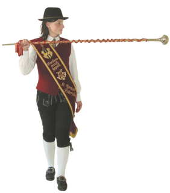
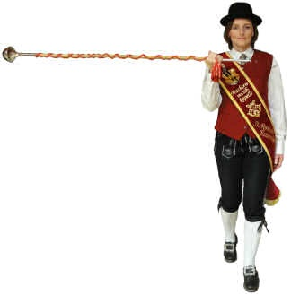
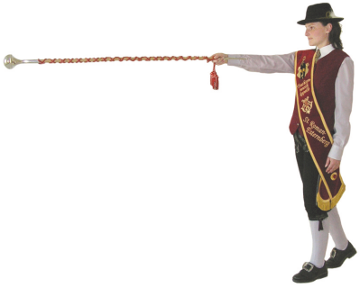
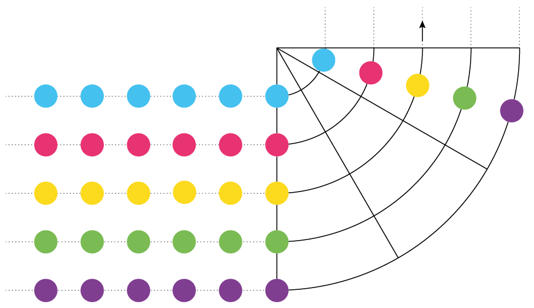
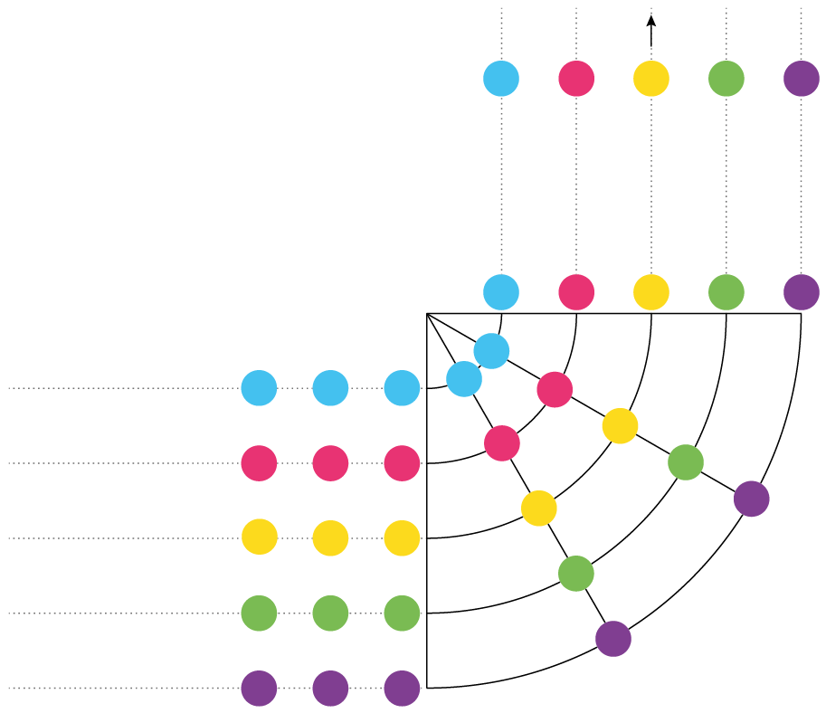
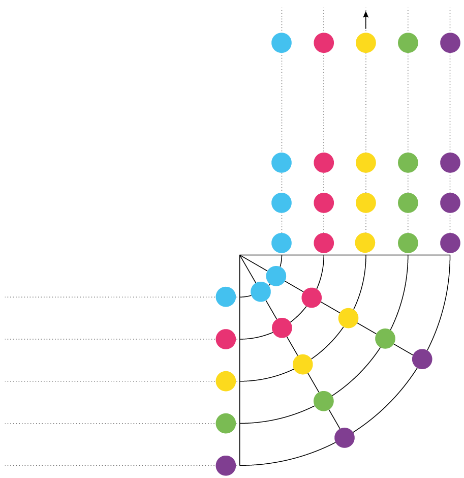

[← Zurück zur Übersicht](README.md)

---

# Kapitel 6 — Die Schwenkung

Die Kapelle biegt ab, ohne die Formation zu verlieren. Sie ist in **allen Stufen** Teil der Wertung — und sie kommt bei jeder Ausrückung vor.

Wir machen **Variante 1: Schwenkung mit Normalschritt in der Außenreihe.**

> **Kein Kommando.** Der Tambourstab zeigt die Richtung an.

---

## Drei Dinge, die immer gelten

- Die einzelnen Linien marschieren **gerade bis zur Schwenkungslinie**
- Die Reihen rücken **nicht nach außen**
- Der **Schwenkungspunkt** wird nicht außer Acht gelassen

Das klingt banal, ist aber der ganze Unterschied zwischen einer sauberen Kurve und einem Knäuel.

---

## Das Zeichen des Stabführers

| Dauer | Was der Stab macht |
|---|---|
| **1 Takt** | Stab in Grundstellung bringen |
| **bis die Richtung erreicht ist** | Zeichen zum Schwenken in **Schulterhöhe**, Kugel bzw. Spitze zum schwenkenden Flügel |
| **1 Takt** | Stab in Grundstellung |
| **2 Takte** | waagrechtes Vorstoßen des Stabes in die gewünschte Richtung |
| **1 Takt** | Stab in Grundstellung — im Spiel wird taktiert, ohne Spiel geht der Stab in „Ruht" |

**Schwenkung nach rechts, mit klingendem Spiel:**

**Schwenkung nach links, mit klingendem Spiel:**

**Waagrechtes Vorstoßen in die neue Richtung:**

Eine **Blickwendung zum schwenkenden Flügel** ist empfehlenswert. Sie kann von Marketenderinnen, Kapellmeister und Stabführer ausgeführt werden und hilft, die Seitenlinie zu halten. Geht der Stabführer allein, macht er keine Blickwendung.

---

## Variante 1 — Normalschritt in der Außenreihe

Mit dem Zeichen des Stabführers beginnt die Schwenkung. **Die folgenden Linien beginnen die Schwenkung an derselben Stelle.**

> ### Der schwenkende Flügel geht im **Normalschritt**.
> Alle anderen gehen mit **entsprechend verkürztem Schritt** — je weiter innen, desto kürzer.

Dabei ist auf die **Seitenrichtung** zu achten. Sie ist das, was die Kurve von außen ordentlich aussehen lässt.

**Am Ende der Schwenkung** gibt die Große Trommel ein akustisches Zeichen zur Aufnahme des vollen Schrittes.

> Diese Variante eignet sich besonders bei Schwenkungen mit **kleinem Innenradius**.

---

## Wer bin ich?

| Position | Schritt |
|---|---|
| **Schwenkender Flügel** (außen) | Normalschritt |
| **Mittlere Reihen** | leicht verkürzt |
| **Innerer Flügel** | am stärksten verkürzt |

Der Grundsatz: **Je kürzer der Weg, desto kürzer der Schritt.** Das Tempo bleibt für alle gleich — nur die Schrittlänge ändert sich.

---

## Die häufigsten Fehler

- Zu früh einbiegen, statt gerade bis zur Schwenkungslinie zu marschieren
- Die eigene Linie beginnt die Schwenkung **nicht an derselben Stelle** wie die vorige
- Nach außen rücken — die Formation wird breiter und die Kurve unsauber
- Der äußere Flügel verkürzt mit → die Kapelle bremst sich selbst aus
- Der innere Flügel geht zu lang → die Reihe verbiegt sich
- Nach der Schwenkung nicht auf das akustische Zeichen der Großen Trommel warten
- Seitenrichtung verlieren

> **Der Test:** Nach der Schwenkung muss die Formation genauso aussehen wie davor. Wenn sie breiter oder schief ist, war es keine Schwenkung, sondern eine Kurve nach Gefühl.

---

*Der ÖBV kennt auch eine Variante 2 mit Normalschritt in der Mittelreihe. Wir machen Variante 1.*

*Grafiken: Österreichischer Blasmusikverband, „Musik in Bewegung" —*
*https://wiki.blasmusik.at/display/MIB/1.+Schwenkung+der+Musikkapelle*

---

[← Kapitel 5: Die Große Wende](05-die-grosse-wende.md) · [Übersicht](README.md) · [Kapitel 7: Stehenbleiben und Beendigung →](07-stehenbleiben-und-beendigung.md)